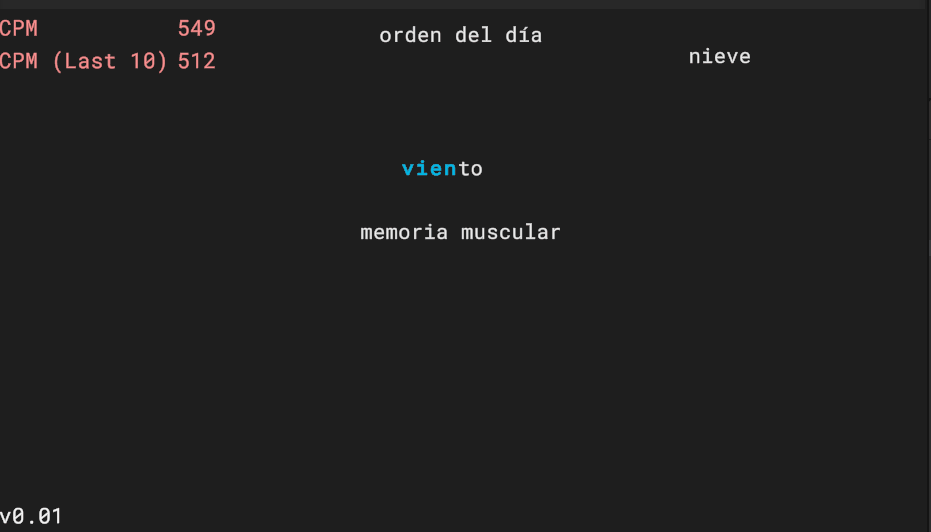

# Unholy Typing

_A simple typing game_

  
<b>Table of Contents</b>

 

1. [About The Project](#-about-the-project)
2. [Overview](#-overview)
3. [Technologies Used](#%EF%B8%8F-technologies-used)
4. [Development](#-development)
5. [Project Files](#-project-files)
  

## 📜 About The Project

A typing game.

## 🎨 Overview

## ⚙️ Technologies used

 

This game has been developed using the **Unity** engine, which uses **C#** as scripting language.

## ⌨ Development

### 📅 Devlog

The [devlog](./devlog.md) is just a markdown file where I add screenshots and gifs about the development process

### 🐙 Git and Github

You can also follow the development of this game through the [issues][gh-issues] and [Github Projects kanban table][gh-projects].
I'm using the [Conventional Commits][conventional-commits] standard so the git log is clean and understandable.

## 💾 Project Files

- [`Assets`](./Assets/). 
    - [`Scripts`](./Assets/Scripts/). This folder contains all the .cs files
    - [`Prefabs`](./Assets/Prefabs/). 

---

#### 🖤 Credits

[gh-issues]: https://github.com/CakeNeka/Unholy-Typing/issues
[gh-projects]: https://github.com/users/CakeNeka/projects/5/views/1
[conventional-commits]: https://www.conventionalcommits.org/en/v1.0.0/
